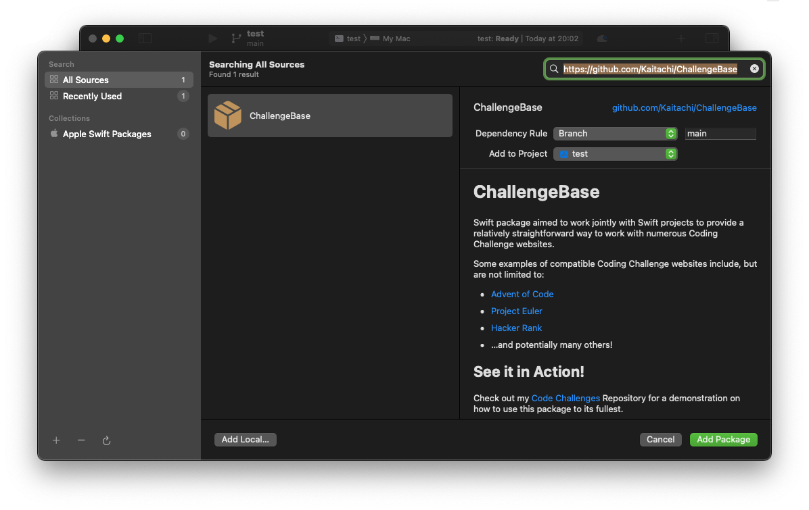

# ChallengeBase

Swift package aimed to work jointly with Swift projects to provide a relatively straightforward way to work with numerous Coding Challenge websites.

Some examples of compatible Coding Challenge websites include, but are not limited to:
* [Advent of Code](https://adventofcode.com)
* [Project Euler](https://projecteuler.net)
* [Hacker Rank](https://www.hackerrank.com)
* ...and potentially many others!

## See it in Action!
Check out my [Code Challenges](https://github.com/Kaitachi/CodeChallenges) Repository for a demonstration on how to use this package to its fullest.

## How Would You Use This?
There are a couple of ways in which you could use this package.

### Start with our Challenge Starter Template
Over at my [Challenge Starter Template Project](https://github.com/Kaitachi/ChallengeStarter), I have prepared a bare-bones Xcode application that can be used to get started quickly. Please do check it out!

### Through Swift Package Manager
If you have an existing Xcode/Swift project that you'd like to add this package to, you can follow these instructions:

1. Within Xcode, with your project open, select File > Add Packages... from the menu bar.
2. On the dialog window, enter the URL for this repository: `https://github.com/Kaitachi/ChallengeBase`
3. Thus far, it is recommended that you set a **Branch** dependency rule that follows the `main` branch

## How It Works
This package is built with a relatively simple and encompassing set of observations about Coding Challenges:

1. Coding Challenges oftentimes contain a set of sample data on which to execute some algorithm to solve a specific problem
2. When this sample data is executed, and output results match expected results, we can then perform the same algorithm against some "real" data that will output the result required to answer the given problem

Using these very same rules, the following concepts were developed:

* **[Challenges](Sources/ChallengeBase/Protocols/Challenge.swift)**, containing their own set of questions/problems, essentially exist to categorize one or more problems as belonging to either one same website or a specific catalogue within a website. This can be likened to [Advent of Code's Events Page](https://adventofcode.com/2022/events), and from here we can say that each year contains its own Challenge, that is, its own set of problems to be solved.
* **[Solutions](Sources/ChallengeBase/Protocols/Solution.swift)** exist for each Challenge, and each Solution consists of one or more *Algorithms* (solutions). Many Coding Challenge websites ask for a single solution (as is the case with [Project Euler](https://projecteuler.net)), but in the odd case that a website allows for multiple algorithms (like in the [Advent of Code's case](https://adventofcode.com), for which one Day's solution is separated in two parts), a Solution could easily be adapted to contain any amount of algorithms (set at a Challenge level).
* **[Test Cases](Sources/ChallengeBase/Protocols/TestCase.swift)**, designed to essentially hold scenario information: *input data*, *expected output data*, and *actual output data*.

There can exist more than one Test Case per Solution, and there can definitely exist more than one Solution per Challenge. All of these concepts are further developed in the [Challenge Starter Repo](https://github.com/Kaitachi/ChallengeStarter) and the [Code Challenges Repo](https://github.com/Kaitachi/CodeChallenges). Be sure to check those out!

Reducing Coding Challenges to just these three components, essentially everything needed for solving them can be created using these building blocks! You can check out a working version of this over in my [Code Challenges Repo](https://github.com/Kaitachi/CodeChallenges).

NOTE: This package doesn't add a huge variety of utility methods. This is done purposefully, mainly to encourage your own helper methods on your own projects. So, get creative! =D

## Want to Contribute?
Contributions are by all means allowed and encouraged here! It is likely that things can be improved for readability, comments explaining how certain parts of the code work, or even to Swift-ify things around. Whatever improvement you see, it will be more than welcome.
